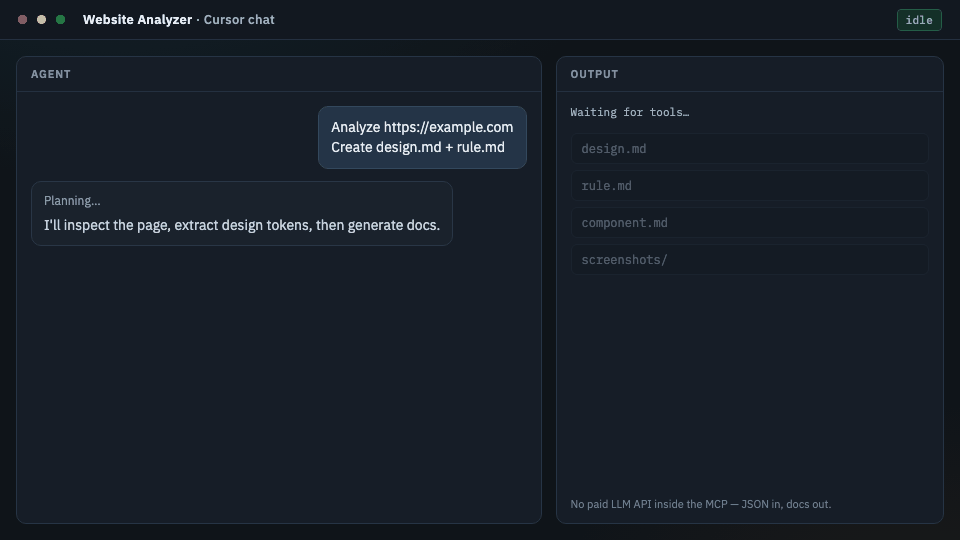

# Website Analyzer MCP

[](https://www.npmjs.com/package/website-analyzer-mcp)
[](LICENSE)
[](https://nodejs.org)
[](https://github.com/bigy2012/website-analyzer/actions/workflows/ci.yml)

**Turn any website into a reusable design system.**

Reverse-engineer live pages into structured design tokens and docs your AI coding agent can use — colors, typography, spacing, components, layout, and responsive behavior.

Built with **MCP** · **Playwright** · **TypeScript**



> Free and open source. This server does **not** call paid LLM APIs. It returns structured JSON (and optional template markdown) to your own Claude / Cursor / VS Code / Gemini / Ollama client.

---

## Why this exists

AI agents are great at writing UI — but they usually guess at design systems. Website Analyzer MCP inspects a real page and hands your agent:

- Design tokens (color, type, spacing, radius, shadow)
- Component and layout signals
- Responsive viewport analysis + screenshots
- Deterministic markdown docs (`design.md`, `rule.md`, …)

Use it to clone a look, audit a site, or bootstrap a design system from production.

## Features

- Page inspection (DOM, landmarks, headings, links, forms)
- Color / typography / spacing extraction
- Border radius & shadow detection
- Layout and component signals
- Responsive analysis (mobile / tablet / desktop)
- Screenshot capture (up to 5 viewports)
- Design system tokens as structured JSON
- Deterministic markdown documentation
- SSRF protection + optional robots.txt respect

## Quick start (end users)

You do **not** need to clone this repo — the package is on npm.

1. Install Playwright’s Chromium once:

   ```bash
   npx playwright install chromium
   ```

2. Add the MCP server in your client config.

**Cursor** (`Settings → MCP` or `~/.cursor/mcp.json`):

```json
{
  "mcpServers": {
    "website-analyzer": {
      "command": "npx",
      "args": ["-y", "website-analyzer-mcp"]
    }
  }
}
```

**Claude Desktop** (`claude_desktop_config.json`):

```json
{
  "mcpServers": {
    "website-analyzer": {
      "command": "npx",
      "args": ["-y", "website-analyzer-mcp"]
    }
  }
}
```

3. Restart the IDE / reload MCP.
4. Ask:

```text
Analyze https://example.com and create design.md
```

`npx -y` downloads the package from npm automatically.

### Supported clients

Claude Code · Cursor · VS Code · Claude Desktop · any MCP-compatible client

## Tools

| Tool | What it does |
|------|----------------|
| `inspect_page` | Structured DOM / page JSON |
| `capture_screenshot` | Viewport PNGs (`mobile` / `tablet` / `desktop`, up to 5 widths) |
| `analyze_design` | Colors, type, spacing, radius, shadows, layout, components → JSON |
| `analyze_responsive` | Breakpoint / media-query analysis (+ optional screenshots) |
| `generate_docs` | Writes `design.md`, `rule.md`, `component.md`, `layout.md`, `content.md`, `README.md` |

### Suggested prompts

```text
Analyze https://example.com

Create:
- design.md
- rule.md
- component.md
- layout.md
- README.md
```

**Preferred flow**

1. `inspect_page` / `analyze_design` / `analyze_responsive` → JSON for the LLM  
2. or `generate_docs` → deterministic files under `docs/<host>/`

## Configuration

Copy `.env.example` or set environment variables:

| Variable | Default | Description |
|----------|---------|-------------|
| `MAX_PAGES` | `20` | Crawl page cap (planned multi-page crawl) |
| `REQUEST_TIMEOUT` | `30000` | Navigation timeout (ms) |
| `MAX_DEPTH` | `2` | Crawl depth (planned) |
| `SCREENSHOT` | `true` | Capture screenshots in `generate_docs` |
| `MOBILE_VIEW` / `TABLET_VIEW` / `DESKTOP_VIEW` | `true` | Which viewport bands to sample |
| `USER_AGENT` | `WebsiteAnalyzerMCP/1.0` | Request user agent |
| `RESPECT_ROBOTS_TXT` | `true` | Honor robots.txt Disallow |
| `MAX_RESPONSE_SIZE` | `5000000` | Max response body size (bytes) |
| `WEBSITE_ANALYZER_OUTPUT` | package `output/` | Override screenshot / output root |

Example with env in Cursor:

```json
{
  "mcpServers": {
    "website-analyzer": {
      "command": "npx",
      "args": ["-y", "website-analyzer-mcp"],
      "env": {
        "REQUEST_TIMEOUT": "45000",
        "RESPECT_ROBOTS_TXT": "true"
      }
    }
  }
}
```

## Develop from source

```bash
git clone https://github.com/bigy2012/website-analyzer.git
cd website-analyzer
npm install
npx playwright install chromium
npm run build
```

Point your MCP client at the built entrypoint:

```json
{
  "mcpServers": {
    "website-analyzer": {
      "command": "node",
      "args": ["/absolute/path/to/website-analyzer/dist/index.js"]
    }
  }
}
```

### Scripts

```bash
npm run typecheck
npm test
npm run smoke
npm run build
npm run demo:gif   # regenerates assets/demo.gif
```

### Docker

```bash
docker compose build
docker compose run --rm website-analyzer-mcp
```

Published images (on tagged releases): `ghcr.io/<owner>/website-analyzer`

## Security

- Blocks localhost / private IP / link-local / cloud metadata SSRF targets
- Optional robots.txt enforcement (`RESPECT_ROBOTS_TXT=true`)
- Timeouts and size caps via env

## Responsible use

Website Analyzer MCP is for **legitimate website analysis** only — for example learning layout patterns, auditing your own sites, or extracting structured signals your AI agent can reason about.

Using this tool does **not** grant permission to copy or reuse another site’s design, content, images, logos, or other assets without authorization.

Please respect:

| | |
|--|--|
| **Copyright** | Design, copy, media, and branding remain owned by their rights holders |
| **Terms of Service** | Follow each site’s ToS and acceptable-use rules |
| **robots.txt** | Honor crawl directives (`RESPECT_ROBOTS_TXT=true` by default) |
| **Rate limits** | Do not overload or scrape aggressively |
| **Privacy** | Do not collect or misuse personal data |
| **Applicable laws** | Including copyright, trademark, and computer-access laws in your jurisdiction |

You are responsible for how you use analysis output. When in doubt, analyze sites you own or have permission to study, and get legal advice for commercial reuse.

## Limitations (v0.1)

- Single URL / single page (multi-page crawler planned)
- Template docs are deterministic heuristics, not LLM-authored prose
- Cross-origin stylesheets may be incomplete

## Release

CI/CD lives in `.github/workflows/`:

- `ci.yml` — typecheck, build, and test on PR/push
- `release.yml` — on `v*` tags, publishes to npm, GHCR, and GitHub Releases

Setup guide: [docs/RELEASE.md](docs/RELEASE.md)

## Contributing

Issues and PRs are welcome. Please keep changes focused, add/adjust tests when touching security or analyzers, and run `npm run typecheck && npm test` before opening a PR.

## License

[MIT](LICENSE)
